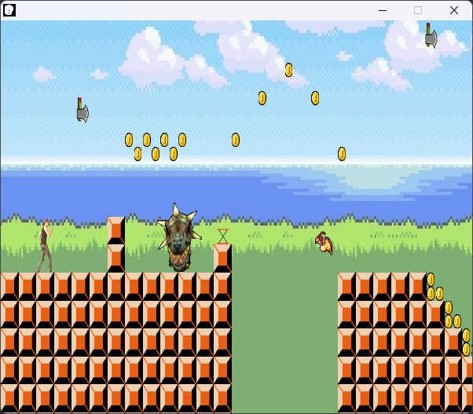

# Kaizo-Blali
Modded Version von Blali 1 in Gamemaker 8.2 
[Link zum Download (Nach unten Scrollen)](https://github.com/iTzWilly/Kaizo-Blali/releases/tag/v0.1.0-alpha) 

## Warum mehrere Blali Dateien?
Blali.gmk ist das Original Blali Spiel, während Blali.gm81 die Modversion ist

## Gamemaker 8.2
Um überhaupt die Blali 1 Spiele zum Laufen zu bringen, benötigt man den Gamemaker 8.2

Links:
- [Portabel](https://www.mediafire.com/file/6l3h4dr7ajj6km2/Game_Maker_8.2_portable.7z/file)
- [Installer](https://www.mediafire.com/file/bqwyde1k1s2hrz2/Game_Maker_8.2_Setup.exe/file)
